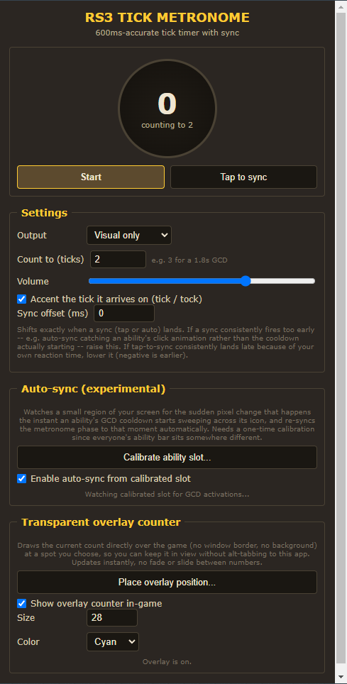
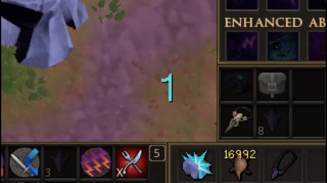

# RS3 Tick Metronome

An [Alt1 Toolkit](https://runeapps.org/alt1) app that keeps a steady beat on RuneScape 3's 600ms game tick, with a visual flash, an audio click, and an optional transparent overlay counter drawn right on top of the game -- similar to the tick-timer metronome tools OSRS players use, adapted for RS3's tick length and its ability GCD.



## What would I use this for?

Anything where "exactly how many ticks until my next action" matters more than a rough feel for it:

- **Tick-perfect skilling methods.** Plenty of training methods depend on acting again the instant the current tick cycle completes, not "as soon as it looks done" -- the flash and click give you a precise, consistent beat to act on rather than eyeballing an animation.
- **Learning a new timing-sensitive method.** Set "Count to" to however many ticks your method's cycle takes, and use the accented arrival tick as a metronome click to build the muscle memory for landing it consistently.
- **Any fixed-tick timing you're tracking manually today** -- resource respawns, buff reapplication, anything you currently count out in your head.

The overlay is the main payoff -- it sits wherever you place it and counts up in real time over live gameplay, no alt-tabbing to a separate window:



## Install

Requires the [Alt1 Toolkit app](https://runeapps.org/alt1) (free, official RuneScape add-on). With Alt1 running:

```
alt1://addapp/https://cuddlyzebra.github.io/RS3metronome/appconfig.json
```

Click that link (or paste it into your browser) while Alt1 is running, and it'll offer to add the app.

## Why this exists

Almost everything in RS3 that's timed happens in whole multiples of the game's 600ms server tick -- movement, skilling actions, and plenty else besides. Knowing exactly where you are in that beat, in real time, helps with any tick-based timing you're doing. This app is a dedicated, always-on-top metronome for that beat, rather than something built into a specific tool.

## How it works

### The beat

A drift-corrected 600ms scheduler fires every tick. Each tick:

- Advances a counter from 1 up to whatever you've set "Count to" as (3 by default, for the 1.8s GCD), then wraps back to 1. The number changes instantly -- no fade or slide -- both in the app window and on the overlay.
- Plays a short click -- a lower "tock" on ordinary ticks, and (if "accent" is on) a higher-pitched "tick" the instant it *arrives* on the tick you're counting to, so you can hear that boundary without looking.
- Flashes the on-screen dial and the whole app window, but only on that arrival tick -- not on every tick. If you're counting to 3, you'll see 1, 2, 3(flash), 1, 2, 3(flash)... rather than a flash every beat.

### Staying in sync

The metronome runs freely from whenever you hit Start, which won't line up with the server's actual tick boundary on its own. A few ways to correct that:

- **Tap to sync (reliable, always available).** The instant you see an XP drop or watch a GCD sweep start on your ability bar, click "Tap to sync". That instant becomes the new tick 0, and everything schedules from there. This is the same technique real OSRS tick tools rely on, and it works regardless of your UI layout.
- **Auto-sync from an XP drop (experimental).** An XP gain lighting up your XP orb, or a new line appearing in the fixed XP notification next to it, is a small patch of screen going from empty/idle to bright all at once -- another large, sudden pixel change the app can watch for and re-sync on automatically, no OCR or reading the actual number involved. **This has to be calibrated on a screen-fixed spot, not the text that floats above your character in the world** -- RS3 shows XP gains in both places at once, and only the fixed one (your XP orb and/or the notification next to it, normally top-of-screen) stays put regardless of where the camera points; the floating one drifts with every camera turn, which breaks a static-region watch. Click "Calibrate XP orb/indicator...", click the orb icon or its fixed text in the captured screenshot, and it's saved. Turn on "Enable auto-sync from XP drop" to start watching.

  Two skill-level quirks to know about: once you're 120 in a skill the orb stops appearing, so calibrate on the fixed text next to where it was instead -- same technique, same fixed spot. Once you hit 200m XP in a skill, RS3 stops showing *both* the orb and the fixed notification, so there's nothing left on screen for this to watch -- at that point, fall back to tap-to-sync (or the ability-GCD auto-sync if you're using abilities) while training that skill.

  A more reliable fixed target, and one that isn't tied to the orb's level-120 quirk: open the RuneMetrics tab with **"Show precise values"** and **"Show XP change value"** turned on in its settings. This adds a small "+xp" popup next to the row of whatever skill just gained XP, inside that docked panel -- another fixed-position, sudden-appear-then-fade signal, same as the orb. Calibrate on that row's popup instead of the orb if you'd rather not depend on the orb being visible. Unlike the orb, this keeps working all the way to 200m XP in a skill -- RuneMetrics tracks XP/hour and per-gain updates regardless of level, so it's the one auto-sync target that covers the whole range, orb or no orb.

  One quirk to know about with the RuneMetrics popup specifically: it can land a tick or so later than the actual gain (the game confirms it slightly after the fact). If auto-sync from it consistently lands a tick late, set **Sync offset (ms)** to -600 to correct for it.
- **Auto-sync off your ability bar (experimental).** RS3 sweeps a visible cooldown overlay across an ability's icon the instant its GCD starts -- a large, sudden pixel change confined to just that icon. The app can watch a small screen region for that change and re-sync automatically. Since everyone's ability bar sits in a different place at a different UI scale, there's a one-time calibration: click "Calibrate ability slot...", click the ability icon you want watched in the captured screenshot, and it's saved. Turn on "Enable auto-sync" to start watching.

  Both auto-sync sources can run at the same time, and either one can recalibrate independently if you move or rescale your UI later.

  These are genuinely experimental. If either fires too early or too late relative to the real event -- likely for the ability-bar source, since the icon may show some instant client-side "pressed" feedback the moment you click, before the server actually confirms the ability and the real cooldown sweep starts on the next tick, up to 600ms later -- use **Sync offset (ms)** in Settings: watch the metronome against real gameplay for a few ticks and nudge it (positive = later, negative = earlier) until the arrival tick lines up with the real event. The same offset also applies to manual tap-to-sync, so it doubles as a reaction-time correction if you tend to tap a bit after the cue.

### Transparent overlay counter

The count can also be drawn directly on top of the game itself -- just the number, no background or window around it, positioned wherever you like. Click "Place overlay position...", click the spot in the captured screenshot, then tick "Show overlay counter in-game". It changes instantly on each tick, same as the number in the app window. Size and color (gold/white/red/green/cyan) are both adjustable.

### Calibrating (XP orb, ability slot, or overlay position)

The XP-drop region, the ability slot, and the overlay position all use the same click-to-place screenshot picker. The captured screenshot is your whole game window shrunk to fit the preview, which can make it hard to click exactly the right pixel -- **scroll the mouse wheel over the preview to zoom in around wherever your cursor is**, right down to individual pixels, then click. "Reset zoom" goes back to the full view. For the two auto-sync sources, you can also widen or heighten the watched spot below the preview if the default doesn't quite cover the icon or text you're targeting.

### Settings

- **Output**: visual + audio, visual only, or audio only.
- **Count to (ticks)**: defaults to 3 (the GCD), but set it to whatever run length you're tracking.
- **Volume** and whether the arrival tick is accented (a distinct tone, and the flash).
- **Sync offset (ms)**: shifts exactly when a sync (tap or auto) actually lands, -600 to +600ms. See the auto-sync note above -- this is the main knob for correcting a sync source that's consistently early or late.

All settings and your calibration are saved locally on your own computer (not synced anywhere) and persist across restarts.

## Troubleshooting

- **Auto-sync fires at the wrong moment.** See the Sync offset note above -- this is almost always a fixed-timing issue, not a broken detector.
- **XP-drop auto-sync never fires (or fires erratically).** You've likely calibrated on the text that floats above your character rather than the fixed XP orb/notification -- the floating one moves with the camera and drifts out of a static watched spot almost immediately. Recalibrate on the orb itself, near the top of the screen, which doesn't move.
- **XP-drop auto-sync stopped working after maxing a skill.** Expected if you calibrated on the orb -- RS3 stops showing both the orb and its fixed notification at 200m XP. Recalibrate on the RuneMetrics "+xp" popup instead (Show precise values + Show XP change value on) -- it keeps updating regardless of level, all the way to 200m. At exactly level 120 (before 200m), only the orb disappears -- its own fixed text, or RuneMetrics, both still work.
- **"Calibrated slot is off-screen".** The game window moved or was resized since you calibrated -- recalibrate.
- **Overlay counter doesn't show.** Make sure you've both placed a position *and* ticked "Show overlay counter in-game", and that the metronome is actually running (Start).
- **Nothing happens when clicking install.** Make sure Alt1 is running first -- the `alt1://` link needs Alt1 registered as a protocol handler, which only happens once Alt1's been installed and run at least once.

## What's next

- Possibly: a keybind for "tap to sync" that works even when the app isn't focused, if Alt1's binding API supports it cleanly.

## Credit

Tick mechanics reference: general RuneScape 3 community knowledge of the 600ms game tick and the 1.8s/3-tick global ability cooldown. This app is an original build.
